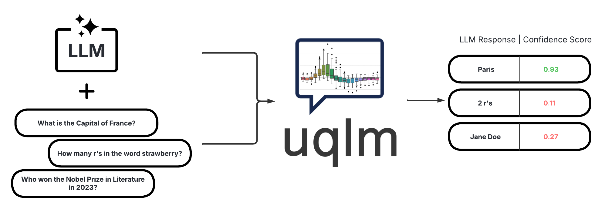
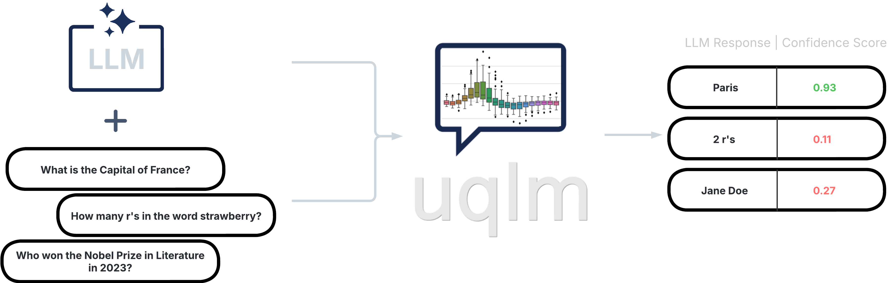

uqlm: Uncertainty Quantification for Language Models
====================================================

A Python library for LLM hallucination detection using state-of-the-art uncertainty quantification techniques.
Each scorer returns a confidence score between 0 and 1, where higher scores indicate lower hallucination likelihood.

.. grid:: 1 1 3 3
   :gutter: 2
   :padding: 3 0 3 0
   :class-container: sd-text-center

   .. grid-item::

      .. button-ref:: getstarted
         :color: primary
         :outline:
         :expand:

         🚀 Get Started

   .. grid-item::

      .. button-ref:: _notebooks/index
         :color: primary
         :outline:
         :expand:

         📓 View Examples

   .. grid-item::

      .. button-ref:: api
         :color: primary
         :outline:
         :expand:

         📖 API Reference

Scorer Types
------------

UQLM provides five categories of scorers. Click a card to explore the options.

.. grid:: 1 2 3 3
   :gutter: 3
   :padding: 2 0 2 0

   .. grid-item-card:: 🌐 Black-Box Scorers
      :link: black-box-scorers
      :link-type: ref

      Measure consistency across multiple LLM generations. Compatible with any model with no access to internals needed.

      +++
      :bdg-warning:`⏱️ Medium latency` :bdg-danger:`💸 Higher cost` :bdg-success:`🌍 Universal`

   .. grid-item-card:: ⚡ White-Box Scorers
      :link: white-box-scorers
      :link-type: ref

      Leverage token probabilities for fast, free single-generation scoring. No extra LLM calls required.

      +++
      :bdg-success:`⚡ Minimal latency` :bdg-success:`✔️ No extra cost` :bdg-secondary:`🔒 Needs logprobs`

   .. grid-item-card:: ⚖️ LLM-as-a-Judge
      :link: llm-as-a-judge-scorers
      :link-type: ref

      Use one or more LLMs to evaluate response reliability. Highly customizable via prompt engineering.

      +++
      :bdg-info:`⏳ Low–Medium latency` :bdg-info:`💵 Variable cost` :bdg-success:`🌍 Universal`

   .. grid-item-card:: 🔀 Ensemble Scorers
      :link: ensemble-scorers
      :link-type: ref

      Combine multiple scorers via weighted averaging for more robust confidence estimates. Tunable for advanced users.

      +++
      :bdg-secondary:`🔀 Flexible latency & cost` :bdg-success:`🌍 Universal`

   .. grid-item-card:: 📝 Long-Text Scorers
      :link: long-text-scorers
      :link-type: ref

      Score uncertainty at the claim level for long-form responses, with support for uncertainty-aware response refinement.

      +++
      :bdg-danger:`⏱️ High latency` :bdg-danger:`💸 High cost` :bdg-success:`🌍 Universal`

Contents
--------

.. toctree::
   :maxdepth: 1

   Get Started <getstarted>
   Scorer Definitions <scorer_definitions/index>
   API <api>
   /_notebooks/index
   Contributor Guide <contribute>
   FAQs <faqs>
